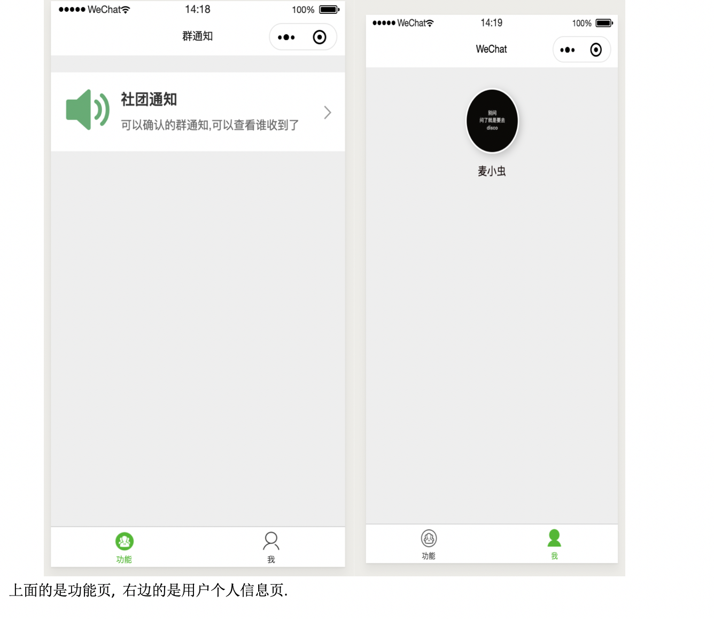
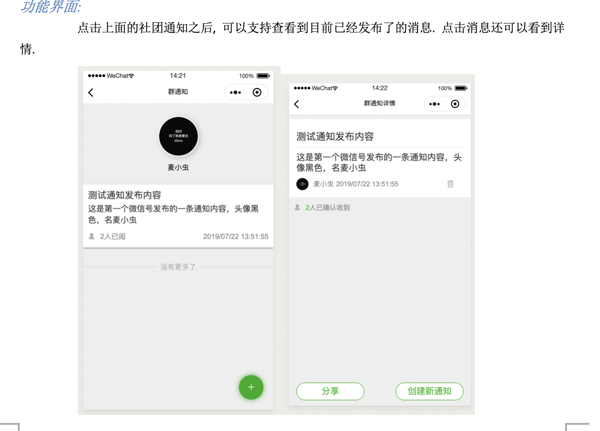
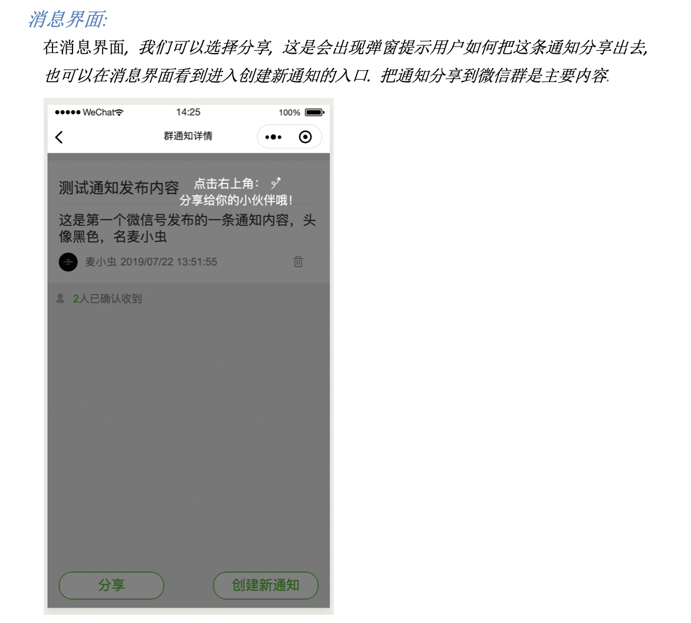
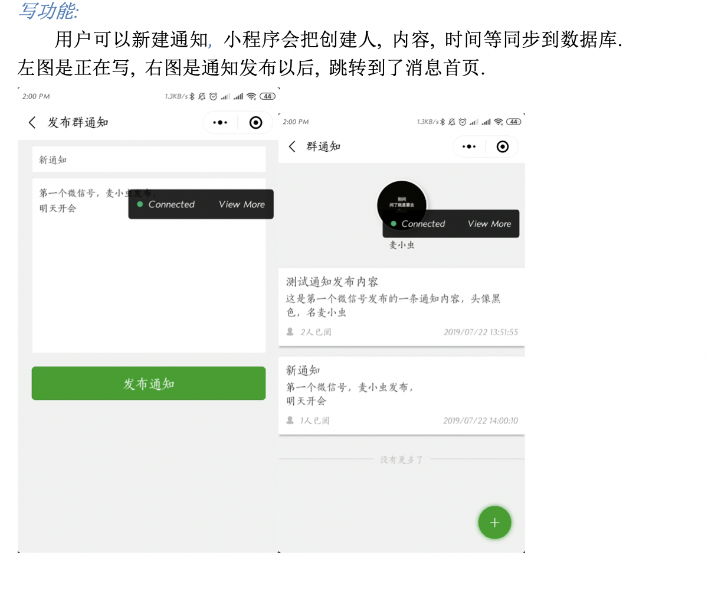
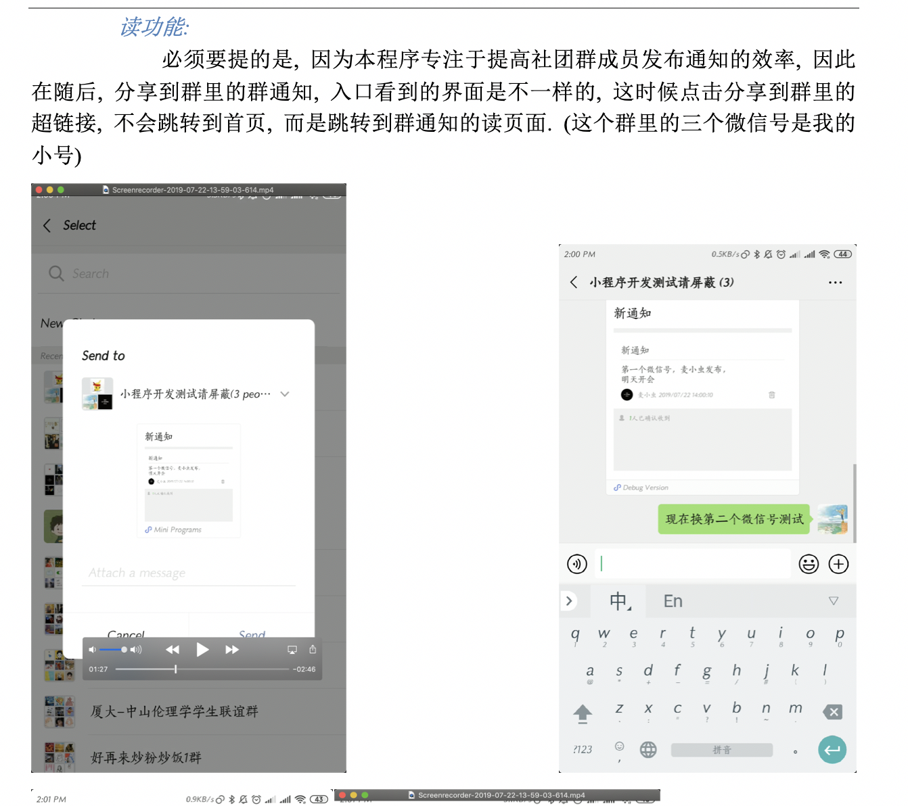
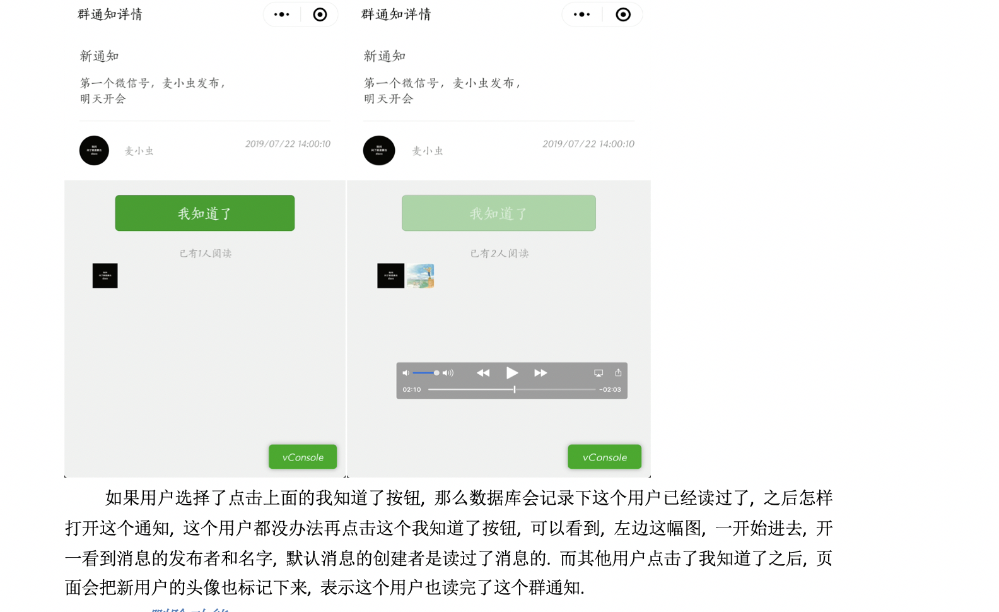
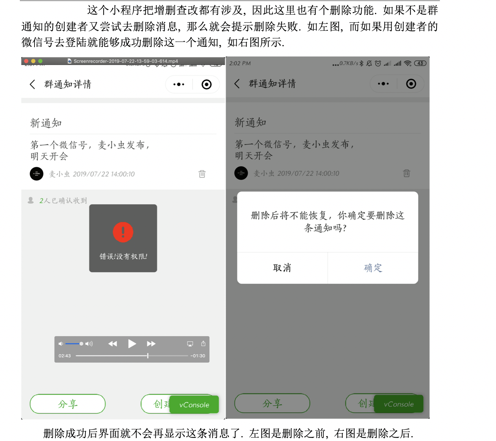

# WeChat-MiniProgram-2019

参考了网上的前端教程, 做了一个可以确认的群通知小程序.

后台上做了点创新, 没有租用服务器处理request请求, 而是尝试了一下微信提供的云数据库, 云函数这些.

总的体验上来说, 微信的相关文档还是欠缺一些清晰度. 而且云数据库的查询等功能欠一点, 比如我要查询嵌套的数组字典这样的需求.

从微信的小程序开发IDE上来说, 感觉上微信做的还是不错的. 遗憾的是希望simulator能够增加一下在聊天记录里看到转发等这样的东西,
只能在小程序界面看的话有些功能测试不了, 而且真机测试也比较麻烦.

*以下是照搬我的实验报告的小程序功能说明*
---
功能描述:

		在微信传统的群里, 往往需要发布群通知. 但是发布群通知存在的一个问题就是, 无法保证全部人都点了这条消息, 即不知道这条消息看了没有. 而在大学的社团群里(比如说我加入的社团), 就会存在很多这样的问题, 每发布一条通知, 需要一群人回复“我收到了”, 这样就很繁琐, 管理员也不好确认.
		因此, 我写的这个小程序, 提出了一个能够使得消息已读, 显示通知精确发布时间, 发布内容, 具体情况, 可以分享到群里, 群成员也可以通过点击“我知道了”按钮进行确认, 并显示出了已读的名单, 还支持删除, 增删查改都涉及到了.
		下面通过截屏具体说明.

